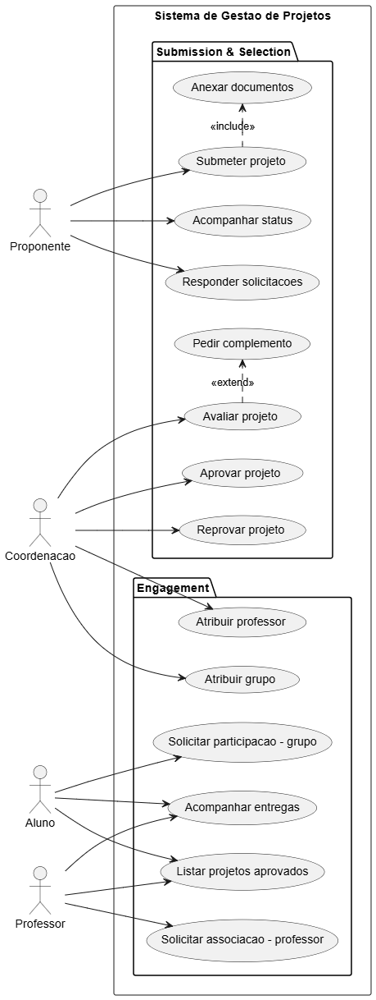

# Diagrama de Casos de Uso

> Adicione aqui o diagrama de casos de uso do sistema.

Se desejar, insira uma imagem:

Ou utilize uma ferramenta como draw.io, Lucidchart, ou exporte do StarUML e adicione o arquivo de imagem na pasta.
